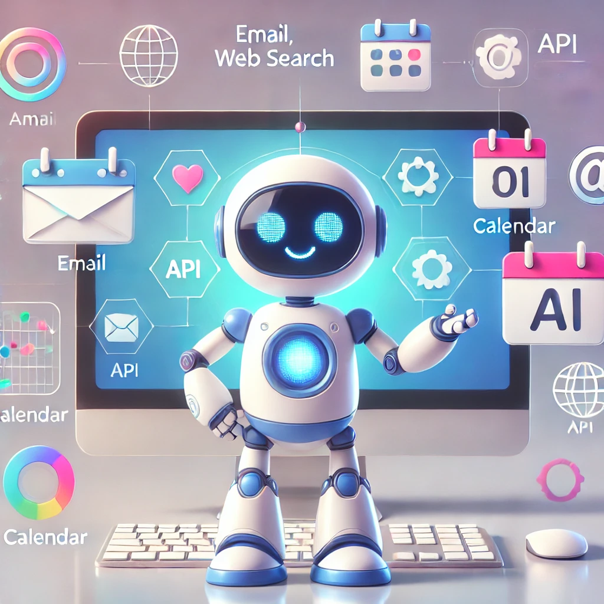
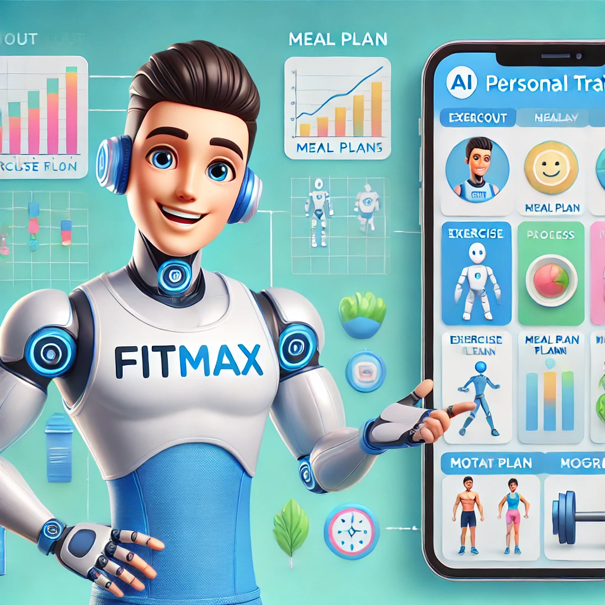
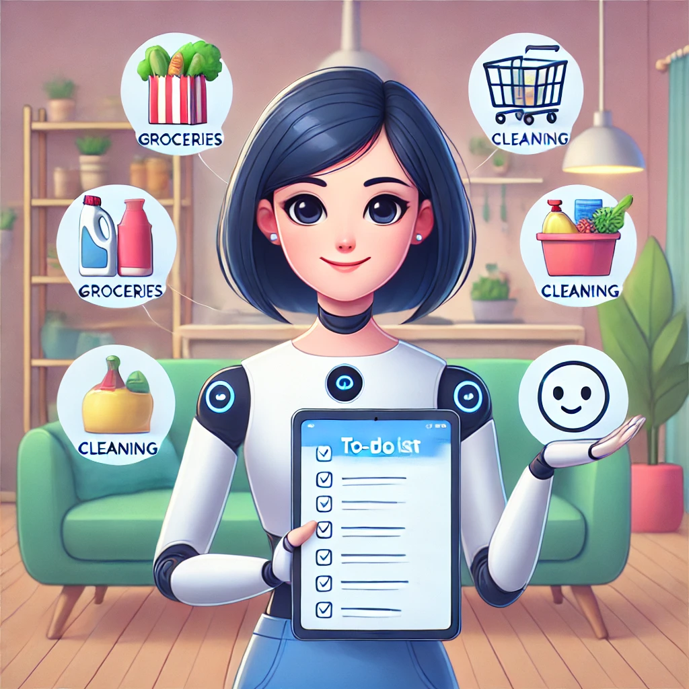

# 🌟 AI Agents: The Next Frontier in AI 🚀

Welcome to your AI Agents journey! This repository is dedicated to understanding the exciting world of AI Agents, where **reasoning, planning, and interaction with the environment come together to achieve amazing results.**

---

## 📖 What is an AI Agent? 🤖

### Definition:
An **AI Agent** is a system that leverages an AI model to interact with its environment to achieve a user-defined objective. It combines **reasoning, planning, and the execution of actions (often via external tools)** to fulfill tasks.

Imagine you have a personal assistant named **Aiden**. You say: 

> “Aiden, I need you to book a flight to Paris and organize my travel itinerary.” ✈️🗼

Aiden understands your request in natural language and starts planning. To achieve the task, Aiden needs to:

1. **Search for available flights.**
2. **Book the most suitable flight.**
3. **Find the best hotels.**
4. **Create a detailed itinerary for your trip.**

Aiden can do all of this because it's not just a chatbot – it’s an **AI Agent**, with the ability to:

- ✅ **Understand** your instructions.
- 🔍 **Plan** how to achieve the task.
- 🔨 **Act** by interacting with various tools and services.

---

### Meet Aiden - The Friendly AI Agent


---

## 🧠 How AI Agents Work

An AI Agent has two main components:

### 1. The Brain (AI Model)
The brain of the agent is usually a **Large Language Model (LLM)**, like **LLaMA, GPT-4, or Gemini**. It’s responsible for:

- **Understanding** natural language inputs.
- **Planning** and strategizing actions to achieve tasks.
- **Generating commands** to use tools or interact with environments.

---

### Definition:
**LLMs (Large Language Models)** are AI models trained on vast amounts of text data to generate human-like text. They excel at understanding and generating language but need external tools to interact with their environment effectively.

---

### 2. The Body (Tools & Actions)
The body represents everything the Agent can **do**. It could be a set of predefined tools like:

- 🔑 **Web Search**
- 📧 **Send Email**
- 📅 **Create Calendar Events**
- 📞 **Make API Calls**

The more tools the Agent has, the broader its capabilities.

---

## 💡 Examples of AI Agents in Action

---

### Example 1: Fitness Buddy 🏋️‍♂️
Meet **FitMax**, your AI personal trainer. You ask:

> “FitMax, help me create a workout plan to build muscle and stay fit.”

Here's what FitMax does:
1. **Understand** your request.
2. **Plan** an exercise schedule based on muscle-building principles.
3. **Act** by giving you detailed workout routines and even suggesting meal plans.

---

### Meet FitMax - The Fitness Buddy



---

### Example 2: House Organizer 🏡
Meet **Clara**, an AI Agent designed to help you manage your home. You say:

> “Clara, I need my groceries ordered, house cleaned, and dinner prepared by 7 PM.”

Here's what Clara does:
1. **Understands** your needs.
2. **Plans** the tasks in order of priority.
3. **Acts** by ordering groceries online, notifying the cleaning service, and scheduling a meal delivery.

---

### Meet Clara - The House Organizer


---

## 🔍 How Do AI Agents Take Actions? 

AI Agents can only **generate text by themselves**, but they achieve amazing results by using **Tools**. 

---

### Definition:
**Tools** are external functions, APIs, or systems that an AI Agent can call to execute actions. They extend the abilities of the AI model beyond text generation.

---

For example, when you ask **Aiden** to book a flight, the LLM generates a command to interact with a flight-booking API:

```python
def book_flight(destination, date, budget):
    """Books a flight based on destination, date, and budget."""
    # Connect to flight booking API
    # Fetch available flights
    # Book the most suitable flight
    return f"Flight to {destination} on {date} booked within budget of ${budget}!"

#The Agent uses it like this:
response = book_flight("Paris", "2025-04-01", 500)
print(response)  # Output: Flight to Paris on 2025-04-01 booked within budget of $500!

```
## 📝 What Can AI Agents Do? 💪

AI Agents can perform **any task you equip them for**, as long as they have the right tools. Some fun possibilities include:

- 📅 **Personal Scheduling**: Automate your daily tasks, meetings, and reminders.
- 🧩 **Creative Writing**: Write stories, blogs, and even scripts!
- 🕹️ **Game NPCs**: Make game characters that learn and adapt.
- 💼 **Customer Support**: Provide accurate and context-aware answers to users.
- 🌐 **Data Analysis**: Process and interpret large datasets.

---

## 🌌 Why Are AI Agents So Powerful? 🚀

The secret sauce of AI Agents lies in their ability to:

- 🧐 **Understand**: Parse natural language inputs effectively.
- 🔄 **Reason & Plan**: Strategize how to achieve tasks.
- ⚙️ **Act**: Use various tools to complete tasks successfully.

---

## 📚 Stay Tuned! 🔔

This repository will be continually updated with **new theoretical insights, practical concepts, and real-world examples of AI Agents**. The journey of learning and building AI Agents has just begun!

---

## 💡 Contributing 🤝

Feel free to contribute by:

- Suggesting improvements.
- Adding your own examples.
- Expanding the explanations.

Together, we can build a comprehensive resource on AI Agents!

---


